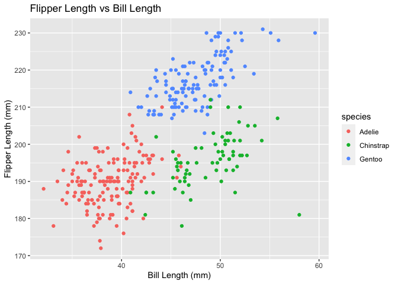

Homework 1
================
Fiona Ehrich

``` r
library(tidyverse)
```

    ## ── Attaching packages ──────────────────────────────────────────────────────────────────────────── tidyverse 1.3.0 ──

    ## ✓ ggplot2 3.3.2     ✓ purrr   0.3.4
    ## ✓ tibble  3.0.3     ✓ dplyr   1.0.2
    ## ✓ tidyr   1.1.2     ✓ stringr 1.4.0
    ## ✓ readr   1.3.1     ✓ forcats 0.5.0

    ## ── Conflicts ─────────────────────────────────────────────────────────────────────────────── tidyverse_conflicts() ──
    ## x dplyr::filter() masks stats::filter()
    ## x dplyr::lag()    masks stats::lag()

``` r
library(palmerpenguins)
```

## Problem 1

#### Create a data frame with the specified elements.

``` r
prob1_df =
  tibble(
    samp = rnorm(10),
    samp_gt_0 = samp > 0,
    char_vec = c("a", "b", "c", "d", "e", "f", "g", "h", "i", "j"),
    factor_vec = factor(c("low", "low", "low", "mod", "mod", "mod", "mod", "high", "high", "high"))
  )
```

#### Take the mean of each variable in my data frame.

``` r
mean(pull(prob1_df, samp))
```

    ## [1] 0.2245174

``` r
mean(pull(prob1_df, samp_gt_0))
```

    ## [1] 0.7

``` r
mean(pull(prob1_df, char_vec))
```

    ## Warning in mean.default(pull(prob1_df, char_vec)): argument is not numeric or
    ## logical: returning NA

    ## [1] NA

``` r
mean(pull(prob1_df, factor_vec))
```

    ## Warning in mean.default(pull(prob1_df, factor_vec)): argument is not numeric or
    ## logical: returning NA

    ## [1] NA

I can take the mean of numbers and logical but not character or factor.

#### Apply `as.numeric` to each variable.

``` r
as.numeric(pull(prob1_df, samp))
as.numeric(pull(prob1_df, samp_gt_0))
as.numeric(pull(prob1_df, char_vec))
as.numeric(pull(prob1_df, factor_vec))
```

Note: The output is not shown for the above code chunk per the
assignment instructions.

`samp` stays the same as it was already numeric. `samp_gt_0` gets turned
into 0s and 1s. `char_vec` just becomes a series of NAs. `factor_vec`
becomes a collection of 1s, 2s, and 3s.

#### Apply the three specified manipulations to the logical vector.

``` r
as.numeric(pull(prob1_df, samp_gt_0)) * (pull(prob1_df, samp))
```

    ##  [1] 1.4819159 0.5189909 0.3543695 0.4871305 0.0000000 0.0000000 1.1841019
    ##  [8] 0.0000000 0.2858474 0.3617279

``` r
as.factor(pull(prob1_df, samp_gt_0)) * (pull(prob1_df, samp))
```

    ## Warning in Ops.factor(as.factor(pull(prob1_df, samp_gt_0)), (pull(prob1_df, :
    ## '*' not meaningful for factors

    ##  [1] NA NA NA NA NA NA NA NA NA NA

``` r
as.numeric(as.factor(pull(prob1_df, samp_gt_0))) * (pull(prob1_df, samp))
```

    ##  [1]  2.9638318  1.0379817  0.7087389  0.9742610 -0.9079462 -0.8419036
    ##  [7]  2.3682039 -0.6790600  0.5716949  0.7234558

## Problem 2

#### Load `penguins` dataset.

``` r
data("penguins", package = "palmerpenguins")
```

#### Description of `penguins` dataset.

``` r
names(penguins)
```

    ## [1] "species"           "island"            "bill_length_mm"   
    ## [4] "bill_depth_mm"     "flipper_length_mm" "body_mass_g"      
    ## [7] "sex"               "year"

``` r
head(penguins)
```

    ## # A tibble: 6 x 8
    ##   species island bill_length_mm bill_depth_mm flipper_length_… body_mass_g sex  
    ##   <fct>   <fct>           <dbl>         <dbl>            <int>       <int> <fct>
    ## 1 Adelie  Torge…           39.1          18.7              181        3750 male 
    ## 2 Adelie  Torge…           39.5          17.4              186        3800 fema…
    ## 3 Adelie  Torge…           40.3          18                195        3250 fema…
    ## 4 Adelie  Torge…           NA            NA                 NA          NA <NA> 
    ## 5 Adelie  Torge…           36.7          19.3              193        3450 fema…
    ## 6 Adelie  Torge…           39.3          20.6              190        3650 male 
    ## # … with 1 more variable: year <int>

``` r
dim(penguins)
```

    ## [1] 344   8

``` r
summary(penguins)
```

    ##       species          island    bill_length_mm  bill_depth_mm  
    ##  Adelie   :152   Biscoe   :168   Min.   :32.10   Min.   :13.10  
    ##  Chinstrap: 68   Dream    :124   1st Qu.:39.23   1st Qu.:15.60  
    ##  Gentoo   :124   Torgersen: 52   Median :44.45   Median :17.30  
    ##                                  Mean   :43.92   Mean   :17.15  
    ##                                  3rd Qu.:48.50   3rd Qu.:18.70  
    ##                                  Max.   :59.60   Max.   :21.50  
    ##                                  NA's   :2       NA's   :2      
    ##  flipper_length_mm  body_mass_g       sex           year     
    ##  Min.   :172.0     Min.   :2700   female:165   Min.   :2007  
    ##  1st Qu.:190.0     1st Qu.:3550   male  :168   1st Qu.:2007  
    ##  Median :197.0     Median :4050   NA's  : 11   Median :2008  
    ##  Mean   :200.9     Mean   :4202                Mean   :2008  
    ##  3rd Qu.:213.0     3rd Qu.:4750                3rd Qu.:2009  
    ##  Max.   :231.0     Max.   :6300                Max.   :2009  
    ##  NA's   :2         NA's   :2

In this dataset there are 8 variables - species, island, bill length,
bill depth, flipper length, body mass, sex, and year. There are some
missing values (NA’s).

``` r
nrow(penguins)
```

    ## [1] 344

``` r
ncol(penguins)
```

    ## [1] 8

There are 344 rows and 8 columns.

``` r
mean(pull(penguins, flipper_length_mm), na.rm = TRUE)
```

    ## [1] 200.9152

The mean flipper length is 200.9152 mm. This is also reflected in the
prior table generated by `summary(penguins)`.

#### Generate and export scatterplot of `flipper_length_mm` (y) vs `bill_length_mm` (x).

``` r
ggplot(penguins, aes(x = pull(penguins, bill_length_mm), y = pull(penguins, flipper_length_mm), color = pull(penguins, species))) + geom_point()
```

    ## Warning: Removed 2 rows containing missing values (geom_point).

<!-- -->

``` r
ggsave("scatter.plot.pdf", height = 4, width = 6)
```

    ## Warning: Removed 2 rows containing missing values (geom_point).
